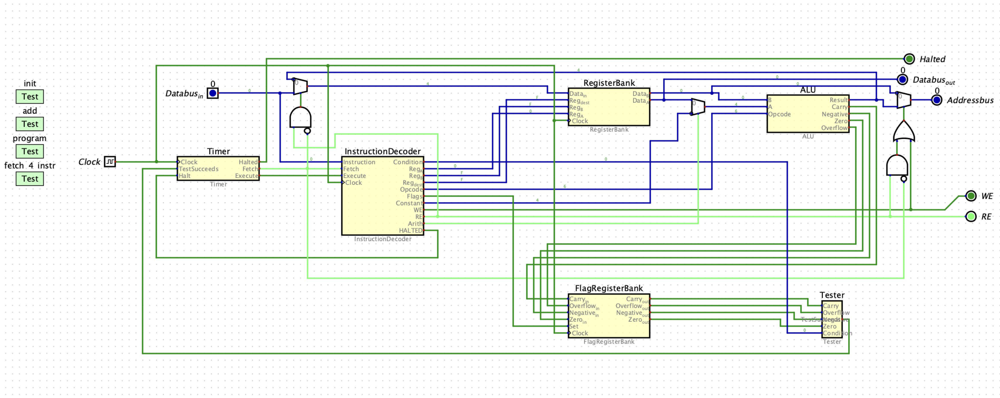
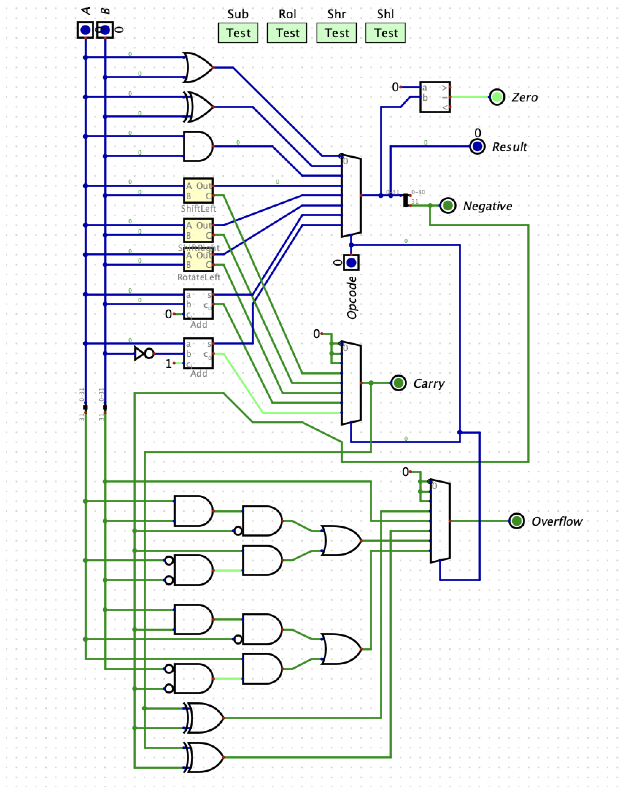
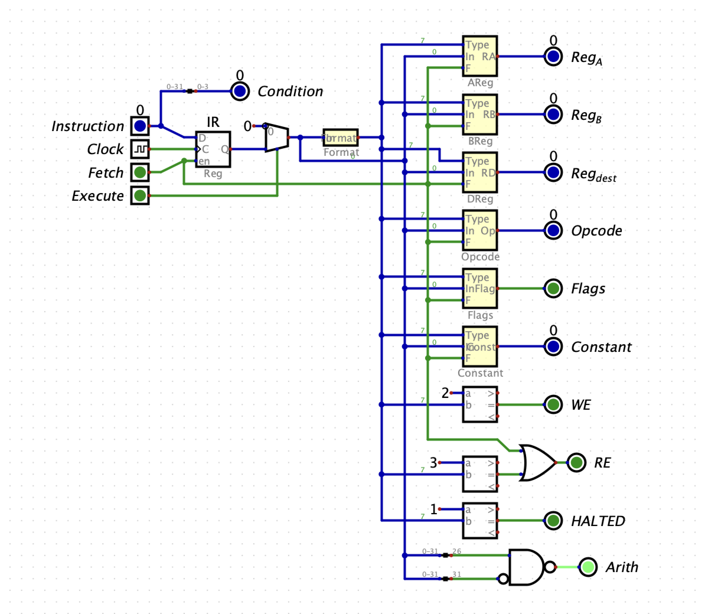
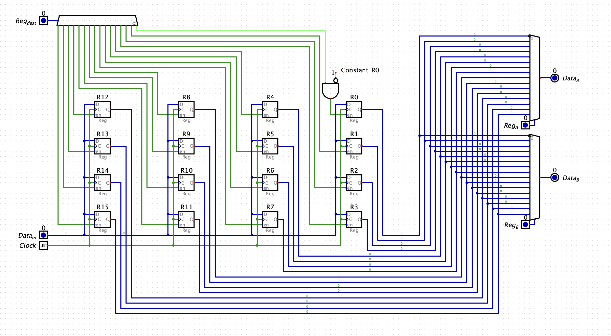

# Custom 32-bit CPU (Digital Logic Implementation)

A custom 32-bit CPU implemented in a digital logic simulator (hneemann/Digital), built entirely from basic logic components.  
The design follows a clean RISC-style architecture and includes a full datapath, ALU, register bank, flag handling, instruction decoder, condition tester, control logic, and a complete top-level integration.

This CPU executes a 32-bit instruction set, supports conditional branching, arithmetic and logical operations, memory access, and implements a correct multi-phase execution cycle (Fetch → Test → Decode/Execute → Pause).

---

## 📐 Architecture Overview

The CPU implements a 32-bit RISC-style architecture:

- 32-bit datapath  
- 16 general-purpose registers (R0–R15)  
  - R13 = FP  
  - R14 = SP  
  - R15 = PC  
- Unified memory architecture (Von Neumann)  
- 32-bit Address and Data buses  
- RE/WE control signals  
- Halted output

### Execution Cycle (4 phases)

1. **FETCH** — Load instruction from memory  
2. **TEST** — Evaluate condition using Tester  
3. **DECODE + EXECUTE** — Perform ALU/load/store/branch ops  
4. **PAUSE** — Wait for next clock cycle  

---

## 🧩 Components Implemented

### **ALU (`ALU.dig`)**
Implements all arithmetic & logic ops:

ADD, SUB, AND, OR, XOR, SHL, SHR, ROL, NEG, NOT, CMPf

Updates flags:
Z, N, C, O

### **Register Bank (`RegisterBank.dig`)**
- 16×32-bit registers  
- R0 hardwired to 0  
- Select lines: RegA, RegB, RegDest  
- Outputs: DataA, DataB  

### **Flag Register Bank (`FlagRegisterBank.dig`)**
Stores flags:
Z, N, C, O  
Supports updates with a Set enable line.

---

### **Tester (`Tester.dig`)**  
Implements all 16 condition codes:

Z, NZ, C, NC,  
N, NN, O, NO,  
LU, GEU, G, L,  
LE, GE, T, F

Output: `TestSucceeds`

---

### **Instruction Decoder (`InstructionDecoder.dig`)**
Handles:

- Extracting opcode, RegA/B, RegDest  
- Determining instruction format (1–6)  
- Handling c10 and c22  
- Sign extension (c32)  
- Generating ALU, mux, and register control signals  
- Implementing LOADHI  
- Generating PC update behavior  
- Read/Write control  

---

### **CPU Top Level (`CPU.dig`)**
Integrates all modules:

- ALU  
- Register Bank  
- Flag Register Bank  
- Instruction Decoder  
- Tester  
- Timer  
- Multiplexers  
- PC incrementer  
- Halt logic  
- Address/Data bus interaction  

Works with official `Computer.dig`.

---

## 🧠 Supported Instruction Set

### Arithmetic & Logic
ADD, ADDf  
SUB, SUBf  
AND, ANDf  
OR, ORf  
XOR, XORf  
SHL, SHLf  
SHR, SHRf  
ROL, ROLf  
NEG, NOT  
CMPf  

### Control Flow
JUMP.cond  
HALT.cond  

### Memory Operations
READ \[B + c10\], D  
WRITE A, \[B + c10\]  
LOADHI c22, D  

### Data Movement
MOVE A/D, D  

---

## 🔁 Conditions Supported (16 total)

Z, NZ, C, NC,  
N, NN, O, NO,  
LU, GEU, G, L,  
LE, GE, T, F

---

## 🧪 Testing

Includes:

- `Tester.dig` — full condition evaluation  
- ALU tests  
- Register & flag correctness tests  
- CPU-level test sequences:
  - Multi-instruction fetch  
  - ALU operations  
  - Branching  
  - Halt behavior  

Compatible with `.hex` loader in `Computer.dig`.

---

## 📁 Repository Structure

```
custom-32bit-cpu/
├── ALU.dig
├── CPU.dig
├── RegisterBank.dig
├── FlagRegisterBank.dig
├── InstructionDecoder.dig
├── Tester.dig
├── Opcode.dig
├── Timer.dig
├── ShiftLeft.dig
├── ShiftRight.dig
├── RotateLeft.dig
├── Constant.dig
├── Format.dig
└── MANIFEST.TXT
```

---

## 📸 Screenshots

### CPU Top-Level


### ALU


### Instruction Decoder


### Register Bank


---

## 🛠️ Running the CPU

Install **Digital**:

https://github.com/hneemann/Digital/releases

Steps:
1. Open `CPU.dig`  
2. Load into `Computer.dig` if needed  
3. Step through Timer cycles to observe execution  

---

## 📜 Summary

This project demonstrates knowledge of:

- CPU datapath architecture  
- Digital logic design  
- Arithmetic/logic unit construction  
- Condition code evaluation  
- Memory and register interactions  
- Finite-state machine execution  
- Custom ISA decoding  

---

## 👤 Author

Chris–Robin Talts  
github.com/ChrisRobinT
linkedin.com/in/chrisrobintalts
